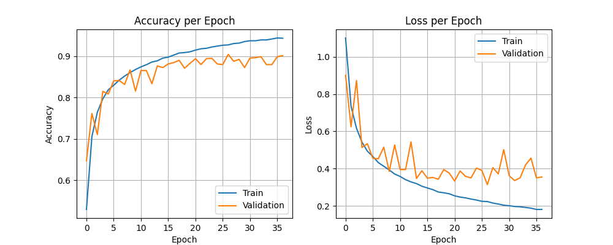

# Iterative CNN Development for Image Classification: From 78% to 90.9% Accuracy

This repository contains a machine learning project showcasing the systematic development of a high-performance image classification model. The project was undertaken as a demonstration of my practical ML skills and problem-solving abilities.

**The complete methodology, analysis, and results are documented in the full technical report.**

### ➡️ **[View the Full Technical Report (PDF)](report/project_report.pdf)**

---

## Final Model Performance

The final model, achieved in the sixth iteration, successfully resolved severe training instability by implementing a learning rate decay schedule. This stable and optimized architecture served as the foundation for an ensemble of models, which produced the final result.

---

## Project Highlights

This project demonstrates a robust, iterative approach to model development. Key challenges were diagnosed and solved methodically:

-   **Problem 1: Severe Overfitting:** Addressed by implementing **Dropout** regularization and **Early Stopping** to prevent the model from memorizing the training data.
-   **Problem 2: Class Imbalance:** A poorly performing class was identified using a confusion matrix and corrected with targeted **Data Augmentation** and **Class Weighting**.
-   **Problem 3: Training Instability:** Erratic validation performance was stabilized by introducing a **Learning Rate Decay Schedule**, the most critical step for achieving convergence.
-   **Final Optimization:** An **Ensemble Method** (majority vote) was applied to the best model to maximize the final Kaggle score, boosting it to **90.9%**.

---

## Tech Stack

-   **Frameworks:** TensorFlow, Keras, Scikit-learn
-   **Libraries:** NumPy, Pandas, Matplotlib
-   **Environment:** Python 3, Google Colab with GPU Acceleration

---

## How to Run This Project

This project was developed in a Google Colab notebook to leverage their free GPU resources.

### Run in Google Colab

This is the easiest way to replicate the results.

**Prerequisites:**
- A Google Account.
- A Kaggle account and your `kaggle.json` API token. You can get this from your Kaggle account page (`Account` -> `API` -> `Create New API Token`).

**Instructions:**
1.  Click the "Open in Colab" badge above.
2.  When the notebook is open, run the first few cells.
3.  You will be prompted to upload your `kaggle.json` file. Please select it from your computer.
4.  Once the Kaggle API is set up, you can execute the rest of the cells sequentially to download the data, train the model, and see the results.

